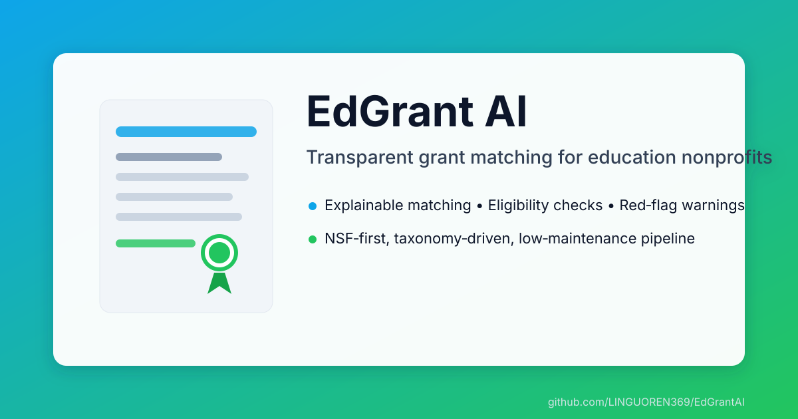

# EdGrant AI

  

EdGrant AI is a lightweight, transparent grant-matching system for education nonprofits. It is NSF-first and designed to be low-maintenance and explainable.

## What it does

- Builds structured grant and organization profiles from text
- Maps phrases to a curated education taxonomy
- Scores alignment with clear Apply / Maybe / Avoid buckets
- Surfaces eligibility constraints and red flags
- Produces JSON reports with ranked recommendations

## Quickstart

1) Install dependencies
- `pip install -r requirements.txt`
2) Set API key (for LLM explanations and embeddings)
- `OPENAI_API_KEY=sk-...`
3) Build taxonomy embeddings (once)
- `make rebuild-taxonomy`
4) Process profiles
- `make grants-all`
- `make orgs-all`
5) Generate recommendations
- `make recs ORG=data/processed_orgs/<org>_profile.json [TOP=10]`
- `make recs-all`

## Documentation map

Start here for details and rationale:

- Project profile: `docs/project_profile.md`
- Matching engine scoring and worked example: `docs/matching_engine_scoring.md`
- Grant profile build process: `docs/grant_profile_build.md`
- Mapping funnel and taxonomy rules: `docs/mapping_funnel.md`
- Organization profile rules: `docs/org_profile_rules.md`
- Tagging pipeline overview: `docs/Tagging Pipeline Overview.md`
- Design reasoning: `docs/design_reasoning.md`
- Case study: `docs/EdGrantAI_Case_Study.md`
- Professor pitch: `docs/professor_pitch.md`
- Diagrams: `docs/structure.png`, `docs/workflow.png`

## Common commands

- Rebuild embeddings: `make rebuild-taxonomy`
- Validate embeddings: `make validate-taxonomy`
- Refresh taxonomy: `make taxonomy-refresh`
- Process all grants: `make grants-all`
- Process all orgs: `make orgs-all`
- Recommendations for one org: `make recs ORG=data/processed_orgs/<org>_profile.json [TOP=10]`
- Recommendations for all orgs: `make recs-all`

For the full list, see `Makefile`.

## Configuration

Runtime settings are defined in `common/config.py` and can be overridden via environment variables or `.env`.

## Repository structure (high level)

- `data/` raw inputs, processed profiles, taxonomy, embeddings
- `extraction/` phrase extraction and source processing
- `mapping/` taxonomy mapping and embedding utilities
- `matching/` scoring and recommendations
- `prompts/` LLM prompts
- `reports/` output recommendation files
- `docs/` long-form documentation
