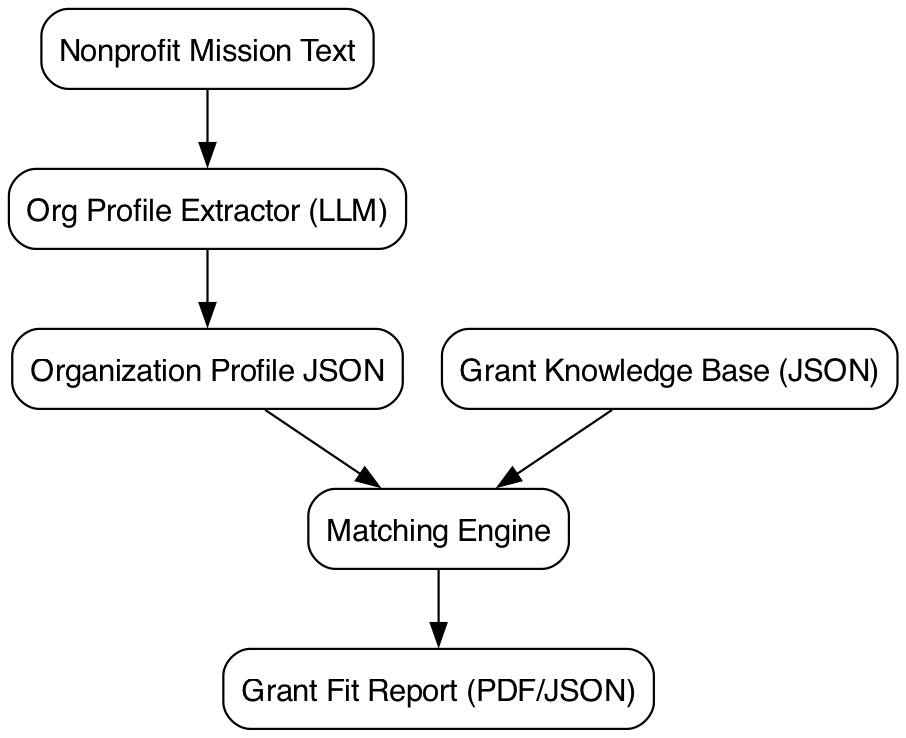

# Architecture

Concise agentic flow with explicit retrieval fallback and results composition.



Regenerate with Graphviz:

```
dot -Tpng -Gdpi=160 -o docs/architecture.png docs/architecture.dot
```

Notes
- Org Profile Extractor (LLM): Produces Organization Profile JSON from mission text.
- Grant Knowledge Base (JSON): Curated grant entries with tags, eligibility, geography.
- Matching Engine: Consumes Org Profile JSON + Knowledge Base to compute transparent scores and rationale.
- Grant Fit Report: Outputs PDF/JSON with ranked grants, rationale, eligibility issues, and red flags.
