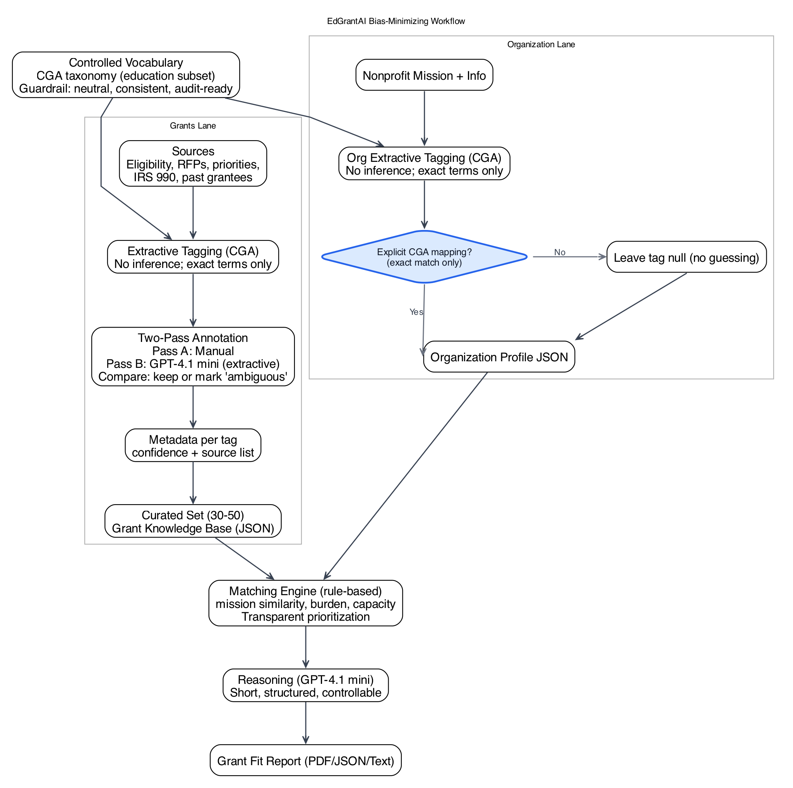

# Bias-Minimizing Workflow

This diagram shows how EdGrantAI minimizes bias while keeping the system simple, ethical, and explainable.



Regenerate with Graphviz:

```
dot -Tpng -Gdpi=160 -o docs/bias_workflow.png docs/bias_workflow.dot
```

## No-Inference Tagging Policy

If the nonprofit's mission statement does not explicitly map to the controlled vocabulary (CGA taxonomy subset):
- Do NOT guess the closest tag.
- Do NOT expand meaning.
- Do NOT paraphrase into a tag.

Inference = bias injection. It also leads to mission drift and inaccurate, unfair matches.

The correct approach:
- Return "null" for that dimension (or leave it empty).

Allowing missing tags plus semantic matching yields:
- Clean, bias-free structured data
- Flexible matching despite incomplete tags
- Full transparency
- No hallucination
- No overclaiming

No inference in tagging; controlled flexibility in matching.
